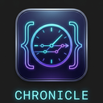
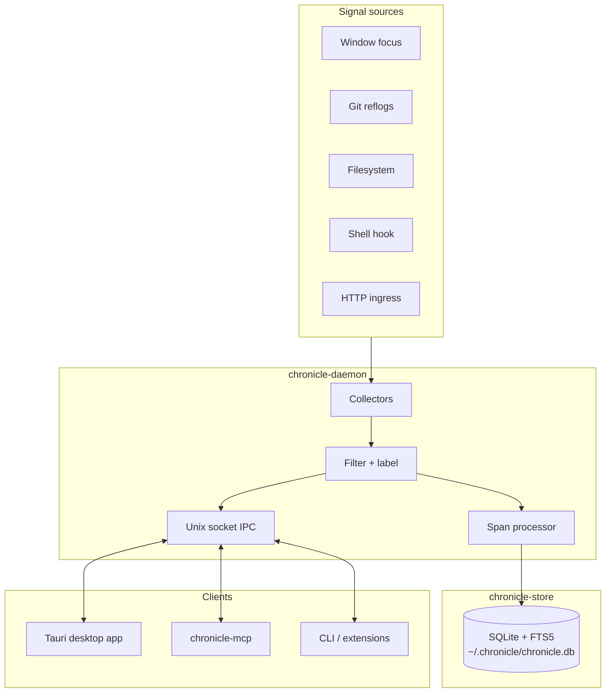

<p align="center">
  
</p>

<h1 align="center">Chronicle</h1>

<p align="center">
  <strong>Local-first developer observability for macOS</strong><br>
  Remember what you were doing — across apps, repos, and terminals — without sending data to the cloud.
</p>

<p align="center">
  <a href="https://github.com/aeswibon/chronicle/releases"></a>
  <a href="LICENSE"></a>
  <a href="https://github.com/aeswibon/chronicle/actions/workflows/ci.yml"></a>
</p>

---

## Overview

Chronicle runs a background daemon that records structured activity — window focus, git operations, terminal commands, and meaningful file changes — into a local SQLite database. Browse timelines in a **Tauri + Svelte** desktop app, search your history, or query recent work from AI tools via **MCP**.

| | |
|---|---|
| **Private** | Data stays in `~/.chronicle/` — no account, no telemetry |
| **Project-aware** | Events grouped by git/Cargo roots |
| **AI-ready** | `chronicle-mcp` for Cursor, Claude Desktop, and other MCP clients |
| **macOS-native** | Collectors use FSEvents, git reflogs, and `lsappinfo` (no Accessibility prompt) |

---

## Architecture



| Crate / binary | Role |
|----------------|------|
| `chronicle-core` | Event schema, spans, sessions |
| `chronicle-store` | SQLite persistence and FTS search |
| `chronicle-ipc` | Length-prefixed JSON over Unix domain socket |
| `chronicle-daemon` | Collectors, filtering, launchd service |
| `chronicle-mcp` | MCP tools for AI assistants |
| `src-tauri` + `src/` | Desktop UI (Svelte 5) |

Deep dive: **[Documentation](docs/README.md)** · start with [Introduction](docs/01-introduction.md)

---

## Install

### macOS (recommended)

Signed, notarized DMGs are on **[GitHub Releases](https://github.com/aeswibon/chronicle/releases)**:

1. Download **arm64** (Apple Silicon) or **x64** (Intel)
2. Drag **Chronicle** to Applications
3. Launch — the background service starts automatically
4. Optional: **Settings → Install shell hook** for terminal capture

### Build from source

```bash
git clone https://github.com/aeswibon/chronicle.git
cd chronicle
bun install
cargo build --release -p chronicle-daemon -p chronicle-mcp

./target/release/chronicle-daemon install --watch ~/Developer
bun run tauri dev
```

Configure watch directories in **Settings** or `~/.chronicle/config.toml`.

### Homebrew

Homebrew looks for `homebrew-chronicle` by default — tap this app repo explicitly:

```bash
brew tap aeswibon/chronicle https://github.com/aeswibon/chronicle
brew trust aeswibon/chronicle
brew install --cask chronicle
```

The cask lives in `Casks/chronicle.rb` (not `Formula/`).

---

## Features

| Area | What Chronicle captures |
|------|-------------------------|
| **Timeline** | Chronological activity with labels and highlights |
| **Projects** | Per-repo views, sorted by last activity |
| **Sessions** | Rule-based daily rollups; optional AI summaries |
| **Search** | FTS over events, projects, and metadata |
| **MCP** | `search_events`, `get_timeline`, `list_projects`, `get_project_context`, … |
| **Privacy** | Collector toggles, retention prune, shell secret redaction |

Collectors can be disabled individually in Settings. See the [capture pipeline](docs/03-capture-pipeline.md) for details.

---

## MCP setup

Register `chronicle-mcp` in your MCP client (daemon must be running):

```json
{
  "chronicle": {
    "command": "/path/to/chronicle-mcp",
    "args": []
  }
}
```

---

## Platform support

| Component | macOS | Linux / Windows |
|-----------|:-----:|:---------------:|
| Daemon + SQLite + IPC | ✓ | ✓ |
| Shell / git / filesystem collectors | ✓ | Partial |
| Window focus collector | ✓ | — |
| Tauri desktop UI | ✓ | Build from source |
| launchd auto-start | ✓ | Manual `chronicle-daemon start` |

---

## Privacy

Chronicle does **not** record keystrokes, clipboard, screenshots, audio, or video. It **does** record app names, window titles, shell commands, git messages, and file paths (not file contents). Everything stays on disk unless you add sync yourself.

→ [Privacy details](docs/01-introduction.md#privacy-and-control)

---

## Development

```bash
cargo test --workspace
bun run check
```

→ [Clients and development](docs/05-clients-and-development.md) · [Contributing collectors](docs/03-capture-pipeline.md)

---

## Documentation

| Guide | Topic |
|-------|-------|
| [Introduction](docs/01-introduction.md) | What Chronicle is and who it's for |
| [System design](docs/02-system-design.md) | Processes, crates, deployment |
| [Capture pipeline](docs/03-capture-pipeline.md) | Collectors, filtering, spans |
| [Storage and query](docs/04-storage-and-query.md) | Schema, FTS, query APIs |
| [Clients and development](docs/05-clients-and-development.md) | IPC, MCP, UI, contributing |
| [External plugins](docs/06-external-plugins.md) | IDE and browser extensions |
| [macOS release signing](docs/07-release-macos.md) | Signed DMGs and CI setup |

---

## License

[MIT](LICENSE)
