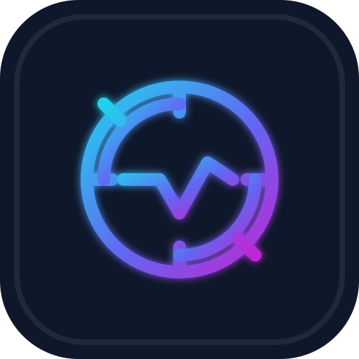

# 1. Introduction

[← Docs index](./README.md) · Next: [System design →](./02-system-design.md)

---

## What is Chronicle?

Chronicle is a **local-first developer activity recorder** for macOS. It runs as a background daemon that observes signals from your machine — which app is focused, which git repos change, which terminal commands finish, which source files are created or deleted — and writes structured events to a SQLite database on disk.

A desktop app (Tauri + Svelte) lets you browse timelines, search history, and drill into projects. An MCP server (`chronicle-mcp`) exposes the same data to AI assistants in Cursor or Claude Desktop.

Nothing leaves your machine unless you explicitly add sync later. There is no account, no telemetry endpoint, and no vendor dashboard.

---

## The problem

Software development is fragmented across tools:

| Tool | What it remembers | What it forgets |
|------|-------------------|-----------------|
| Git | Commits, branches | Everything before commit, uncommitted work |
| Shell history | Commands (per shell) | Context: which repo, which app |
| IDE local history | File edits (per editor) | Cross-editor, terminal, browser |
| Time trackers | Blocks you manually log | Automatic correlation |
| Screen recording | Everything visually | Searchable, structured, private |

When you return from a meeting or switch tasks, you often ask:

- *What was I doing in that repo?*
- *Which branch was I on?*
- *What command did I run before the build failed?*

Chronicle answers those questions by **correlating** coarse-grained signals into a **project-tagged timeline** you can search days later.

---

## Who is Chronicle for?

**Good fit:**

- Individual developers on macOS who want a personal work log
- People using AI coding tools who want assistants to query recent activity via MCP
- Teams of one who need context recovery without SaaS observability

**Not a fit (today):**

- Production service monitoring (use OpenTelemetry, Datadog, etc.)
- Team-wide analytics or manager dashboards
- Keystroke-level replay or screen capture
- Linux/Windows (collectors are macOS-specific)

---

## Why use Chronicle?

### 1. Automatic, low-friction capture

Install the daemon once. Optionally install a zsh/fish hook for terminal commands. Chronicle fills in the timeline while you work — no start/stop buttons.

### 2. Project-aware memory

Events carry a `project` field when Chronicle can resolve a git or Cargo root. The Projects view and per-project pages group activity by repository, not just by timestamp.

### 3. Searchable local history

FTS5 full-text search runs over event source, type, project, and metadata. Find *"that cargo test"* or *"commit message about auth"* without grepping shell history.

### 4. AI-native access

`chronicle-mcp` tools (`search_events`, `list_projects`, `get_timeline`, `get_project_context`) let models query your recent work with structured JSON instead of guessing from chat context.

### 5. Privacy and control

- Data path: `~/.chronicle/chronicle.db` — yours to backup, delete, or inspect
- Config path: `~/.chronicle/config.toml` — watch directories you choose
- Filter layer drops noise before persistence (Chronicle UI focus, `cd`, `file.modified`, etc.)

---

## How Chronicle compares

| Approach | Chronicle | Alternative mental model |
|----------|-----------|--------------------------|
| Personal timeline | ✓ Core product | Rewind.ai, screen memory tools (visual, not structured) |
| Git log | Superset of commits | Chronicle includes focus, shell, uncommitted context |
| `atuin` / shell history | Overlaps on commands | Chronicle adds app focus + git + project tags |
| WakaTime | Coding time stats | Chronicle is self-hosted, richer event model, no SaaS |
| ActivityWatch | Cross-platform time tracking | Chronicle is dev-specific (git, shell, source files) |

Chronicle is deliberately **narrow**: developer observability for one person on one Mac, optimized for recall and AI tooling rather than billing or team metrics.

---

## Design principles

These constraints shape every architectural decision. See [System design](./02-system-design.md) for how they map to code.

### Local-first

The daemon is the source of truth. Clients (UI, MCP, CLI) are stateless readers over IPC. No cloud dependency for core features.

### Minimal capture surface

Record **metadata** (app name, path, command string, git reflog line), not **content** (file bodies, keystrokes, pixels). See [Capture pipeline — Privacy](./03-capture-pipeline.md#what-is-not-captured).

### Single writer

One `chronicle-daemon` process holds `~/.chronicle/daemon.lock` and writes SQLite. Prevents WAL corruption from concurrent writers.

### Stable event contract

`CanonicalEvent` in `chronicle-core` is the boundary between collectors, storage, UI, and MCP. Version field (`"1.0"`) reserved for future migrations.

### Fail soft for the user

If the daemon stops, macOS keeps working. The UI shows "daemon disconnected." Collectors resume on restart; no events are silently invented.

### Noise rejection early

`event_filter::should_record` runs **before** insert and broadcast. Junk never hits the database or live feed.

---

## What you get out of the box

| Surface | Capabilities |
|---------|--------------|
| **Timeline** | Live feed + recent spans (coding, terminal, idle) |
| **Projects** | Git/cargo roots with last-active timestamps |
| **Project detail** | Sessions + filtered activity per repo |
| **Session detail** | Span window + events inside it |
| **Search** | FTS keyword search |
| **Settings** | Watch dirs, shell hook install, theme |
| **MCP** | Five tools for AI clients |
| **CLI** | `start`, `status`, `install`, `hook` |

---

## Glossary

| Term | Meaning |
|------|---------|
| **Event** | Atomic activity record (`CanonicalEvent`) |
| **Span** | Derived session segment (e.g. 45m of "coding" on project X) |
| **Session** | Higher-level grouping (schema exists; UI uses spans today) |
| **Project** | A git or Cargo repository root stored in `projects` table |
| **Collector** | Background task that emits events (focus, git, shell, fs) |
| **Daemon** | `chronicle-daemon` — collectors + store + IPC server |

---

## Next steps

- **[System design](./02-system-design.md)** — processes, crates, diagrams, deployment
- **[Quick start](../README.md)** — install commands in the root README
