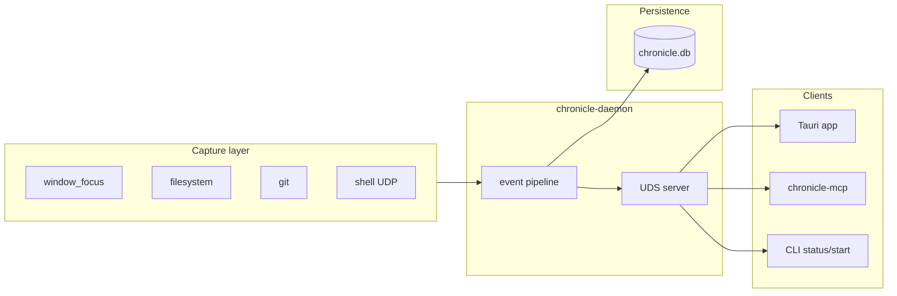
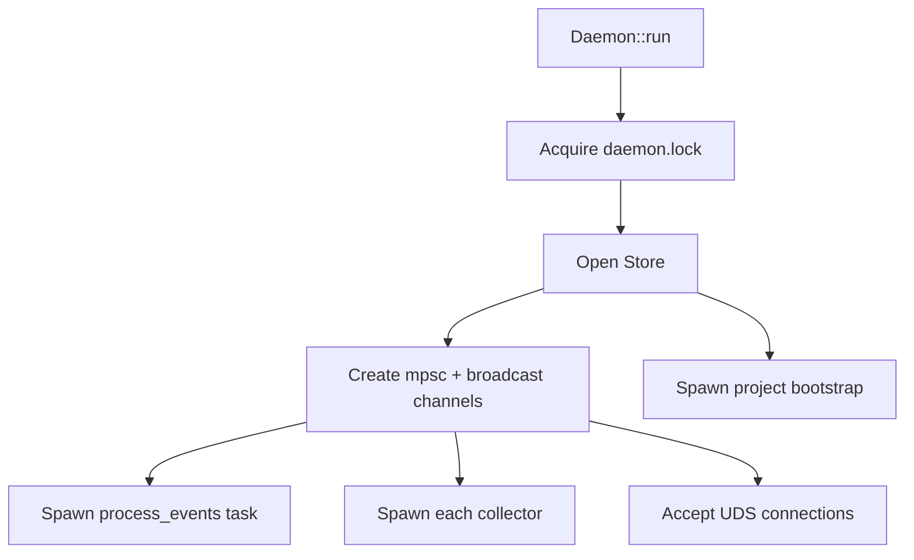

# 2. System design

[← Introduction](./01-introduction.md) · [Docs index](./README.md) · Next: [Capture pipeline →](./03-capture-pipeline.md)

---

## High-level topology

Chronicle splits into three layers:

1. **Capture** — macOS collectors inside `chronicle-daemon`
2. **Persistence** — `chronicle-store` (SQLite + FTS)
3. **Clients** — Tauri UI, `chronicle-mcp`, CLI

All clients talk to the daemon over a **Unix domain socket**. None open the database directly.



---

## Processes and binaries

| Binary | Package | Lifetime | Role |
|--------|---------|----------|------|
| `chronicle-daemon` | `chronicle-daemon` | launchd / manual | Collectors, filter, span processor, IPC, SQLite writes |
| Chronicle.app | `src-tauri` | User session | Svelte UI; Tauri commands → IPC |
| `chronicle-mcp` | `chronicle-mcp` | Per MCP session | Stdio MCP ↔ IPC bridge |
| `chronicle-daemon` subcommands | same | One-shot | `install`, `hook`, `status` |

There is no separate "store service." The daemon embeds `chronicle-store::Store` behind an `Arc<Mutex<Store>>`.

---

## Cargo workspace

```
crates/
├── chronicle-core/     # Types only — no I/O
├── chronicle-store/    # SQLite — depends on core
├── chronicle-ipc/      # Protocol — depends on core
├── chronicle-daemon/   # Binary + collectors — depends on core, store, ipc
├── chronicle-mcp/      # Binary — depends on core, ipc
├── chronicle-plugin/   # Stub
└── chronicle-ai/       # Stub

src-tauri/              # NOT in workspace — path-deps to core + ipc
src/                    # SvelteKit frontend
```

### Dependency rules

- **chronicle-core** has zero Chronicle dependencies — safe to share with any client.
- **chronicle-ipc** defines the API contract; bump carefully when adding requests.
- **chronicle-daemon** is the only writer to SQLite in normal operation.
- **src-tauri** never depends on `chronicle-daemon` (avoids pulling notify, launchd logic into the GUI).

---

## Daemon internals

`Daemon::run` in `crates/chronicle-daemon/src/daemon.rs` orchestrates:



### Concurrency model

| Mechanism | Use |
|-----------|-----|
| `tokio::mpsc` (1024) | Collectors → `process_events` |
| `tokio::sync::broadcast` (256) | Live events → `Subscribe` IPC clients |
| `Arc<Mutex<Store>>` | Serialize DB access across IPC handlers |
| `tokio::spawn` | Per-collector tasks, per-connection handlers |
| `spawn_blocking` | Window focus AppleScript / heavy disk scan |

Collectors are **push-based**: they send `CanonicalEvent` and do not await persistence.

### Graceful shutdown

`SIGINT` / `SIGTERM` break the accept loop. In-flight IPC connections drain naturally; there is no explicit flush hook yet.

### Singleton enforcement

`singleton::DaemonLock` writes `~/.chronicle/daemon.lock`. A second `start` fails fast instead of corrupting WAL.

---

## Client architecture (Tauri)

```
Svelte page
  → invoke('get_events', …)
    → commands.rs
      → chronicle_ipc::Client::connect("~/.chronicle/chronicle.sock")
        → DaemonRequest / DaemonResponse
```

Live timeline:

```
start_event_stream
  → subscribe IPC
    → listen('chronicle-event') in Svelte
```

The UI uses `@sveltejs/adapter-static` with SPA fallback — routing is client-side (`/projects/[name]`, `/sessions/[id]`).

**Icon resolution** is special-cased: `icons.rs` runs a precompiled Swift helper (`chronicle-icon`) to fetch macOS app icons without AppleScript dialogs.

---

## MCP architecture

`chronicle-mcp` is intentionally **out-of-process**:

- Cursor spawns it as a child with stdio pipes
- It connects to the same UDS as the UI
- Tools are thin IPC wrappers returning JSON text

This mirrors how other MCP servers work and keeps MCP dependencies (`rmcp`) out of the daemon and GUI.

---

## Configuration and paths

| Path | Owner | Purpose |
|------|-------|---------|
| `~/.chronicle/chronicle.db` | Store | Event data |
| `~/.chronicle/config.toml` | Daemon | `watch_dirs = ["…"]` |
| `~/.chronicle/daemon.lock` | Daemon | Singleton |
| `~/.chronicle/chronicle.sock` | IPC | Default socket |
| `~/Library/LaunchAgents/com.chronicle.daemon.plist` | install | launchd |
| `~/Library/Logs/chronicle.log` | launchd | stdout |
| `~/.chronicle/hooks/` | hook install | zsh/fish scripts |

Watch directory resolution (`watch_dirs.rs`):

1. CLI `--watch` flags (highest priority when non-empty)
2. `config.toml` `watch_dirs`
3. Defaults: `~/Developer`, `~/Desktop`, `~/Documents`, `/Volumes/*/developer`
4. `CHRONICLE_WATCH` env (`:`-separated paths)

`install` persists CLI watch paths to config and embeds them in the launchd plist.

---

## Deployment model (macOS)

```bash
cargo build --release -p chronicle-daemon
./target/release/chronicle-daemon install --watch /path/to/code
launchctl load ~/Library/LaunchAgents/com.chronicle.daemon.plist
```

The plist runs `chronicle-daemon start` with `--socket`, `--store`, repeated `--watch`, and `CHRONICLE_WATCH` in `EnvironmentVariables`.

Restart after config changes:

```bash
launchctl kickstart -k gui/$UID/com.chronicle.daemon
```

---

## Failure modes

| Symptom | Likely cause | Fix |
|---------|--------------|-----|
| UI "daemon disconnected" | Daemon not running | `launchctl kickstart` or `chronicle-daemon start` |
| Empty projects | Watch dirs miss your code | Settings → watch dirs, or `install --watch` |
| No git events | Repo not under watch tree | Add parent dir; git collector scans recursively |
| No shell events | Hook not installed | Settings → Install zsh hook |
| `early eof` on IPC | Daemon too old for request type | Rebuild and restart daemon |
| Duplicate events in UI | Normal — collapse layer dedupes display | — |

---

## Extension points (planned)

| Extension | Status | Entry point |
|-----------|--------|-------------|
| New collector | Implement today | `collectors/`, register in `daemon.rs` |
| IPC request | Implement today | `chronicle-ipc`, `handle_connection` |
| MCP tool | Implement today | `chronicle-mcp/src/main.rs` |
| External `emit_event` | Documented + sample | `docs/06-external-plugins.md`, `scripts/emit_event.py` |
| Rule engine | Implemented | `rule_engine.rs` — activity labels on events/spans |
| Collector opt-in | Implemented | `chronicle-config`, Settings UI |
| Dynamic plugin | Stub | `chronicle-plugin` |
| On-device AI summary | Stub | `chronicle-ai` |
| Semantic search | IPC enum exists | `SearchMode::Semantic` unimplemented |

---

## CI/CD

`.github/workflows/ci.yml`:

- `cargo fmt --check`, `clippy -D warnings`, `cargo test` on Ubuntu + macOS
- `bun run check` + `bun run build` on Ubuntu

Release workflow builds Tauri artifacts on tag; Homebrew cask in `Casks/chronicle.rb` (`brew tap aeswibon/chronicle && brew install --cask chronicle`).

---

## Next steps

- **[Capture pipeline](./03-capture-pipeline.md)** — collectors, filters, spans, projects
- **[Storage and query](./04-storage-and-query.md)** — schema and SQL
