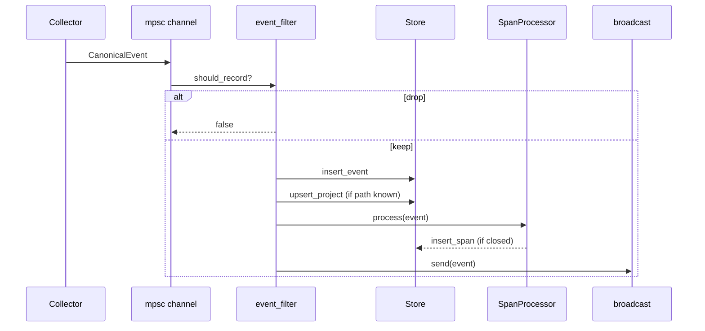

# 3. Capture pipeline

[← System design](./02-system-design.md) · [Docs index](./README.md) · Next: [Storage and query →](./04-storage-and-query.md)

---

## Overview

The capture pipeline turns raw macOS signals into storable `CanonicalEvent` records, optionally derives `Span` rows, and updates the `projects` table.



Every collector implements the same contract: send events on a `tokio::sync::mpsc::Sender<CanonicalEvent>`. The daemon owns the receiver.

---

## Canonical event contract

Defined in `crates/chronicle-core/src/lib.rs`:

```rust
pub struct CanonicalEvent {
    pub version: String,           // "1.0"
    pub id: Uuid,
    pub timestamp: i64,            // Unix ms UTC
    pub source: String,            // App name, "git", shell name, etc.
    pub category: EventCategory,
    pub r#type: String,            // e.g. "process.focus"
    pub project: Option<String>,   // Repo folder name
    pub workspace: Option<String>,
    pub duration_ms: Option<u64>,
    pub metadata: serde_json::Value,
}
```

### Categories and typical types

| Category | Example `type` values | Collector |
|----------|----------------------|-----------|
| `os` | `process.focus` | window_focus |
| `shell` | `command.completed`, `command.failed` | shell |
| `git` | `commit.created`, `branch.checkout`, `merge.completed` | git |
| `filesystem` | `file.created`, `file.deleted` | filesystem |
| `ide` | (reserved) | — |
| `browser` | (reserved) | — |
| `build` | (reserved) | — |

**Important:** `source` should identify the *emitter* (Cursor, iTerm, `git`), not the string `chronicle-daemon`. This keeps timeline labels accurate.

### Metadata conventions

| Key | Used by | Meaning |
|-----|---------|---------|
| `app_name` | focus | Human-readable app name |
| `bundle_id` | focus | macOS bundle identifier |
| `window_title` | focus | Front window title |
| `command` | shell | Full command line |
| `exit_code` | shell | Process exit status |
| `cwd` | shell | Working directory |
| `duration_ms` | shell | Wall time (from hook) |
| `path` | filesystem | File path |
| `extension` | filesystem | File extension |
| `project_path` | git, shell, fs | Absolute repo root |
| `branch` | git | Current branch name |
| `reflog` | git | Last reflog message |

---

## Collectors

### Window focus (`window_focus.rs`)

- **Mechanism:** Poll reflogs every 20s (plus 72h backfill on first sight); rescans repos every 2m
- **Emits:** `os` / `process.focus`
- **Metadata:** `app_name`, `bundle_id` (`window_title` omitted unless a future opt-in path adds it)
- **Project detection:** Primarily from filesystem/git collectors; window-title parsing is not used on the default macOS path

**Design note:** Uses `lsappinfo` instead of AppleScript/System Events so the daemon does not trigger macOS Accessibility or Automation permission dialogs. App icons are resolved separately in the Tauri layer via a compiled Swift helper.

### Filesystem (`filesystem.rs`)

- **Mechanism:** `notify` with `RecursiveMode::Recursive` on watch dirs
- **Emits:** `filesystem` / `file.created` | `file.deleted` (not `file.modified`)
- **Debouncing:** 3-second per-path debounce to reduce FSEvents storms

**Watched extensions** include `rs`, `ts`, `js`, `py`, `go`, `svelte`, `md`, etc. — see `SOURCE_EXTENSIONS` in source.

**Ignored directories:** `node_modules`, `target`, `.git`, `dist`, `.svelte-kit`, `Library`, `.chronicle`, …

**Ignored files:** `.DS_Store`, `Cargo.lock`, `bun.lock`, …

### Git (`git.rs`)

- **Mechanism:** Poll all `.git/logs/**` every 20s; 72h backfill on first sight (HEAD + `origin/*`); repo rescan every 2m
- **Discovery:** `discover_repo_paths` walks watch trees (depth 8) for `.git` or `Cargo.toml`
- **Emits:** Parsed reflog lines with real timestamps from reflog headers

| Reflog pattern | `type` |
|----------------|--------|
| `commit` | `commit.created` |
| `merge` | `merge.completed` |
| `rebase` | `rebase.completed` |
| `pull` / `fast-forward` | `pull.completed` |
| `fetch` | `fetch.completed` |
| `push` / `update by push` | `push.completed` |
| checkout / switch | `branch.checkout` |

Cursors persist in `~/.chronicle/git_cursors.json` so restarts do not duplicate events.

### Shell (`shell.rs`)

- **Mechanism:** UDP listener on `127.0.0.1:9712`
- **Payload:** JSON `{"cmd","exit_code","dur","cwd"}` from zsh/fish hooks
- **Emits:** `shell` / `command.completed` or `command.failed`

Hook source: `assets/hooks/chronicle.zsh` — uses `preexec` / `precmd` zsh hooks and `python3` for UDP send (no extra deps).

Install paths:

- CLI: `chronicle-daemon hook --shell zsh|bash|fish`
- UI: Settings → Install shell hook
- Manual: `~/.chronicle/hooks/chronicle.{zsh,bash,fish}`

### Collector opt-in

Configured in `~/.chronicle/config.toml` and **Settings → Collectors**:

```toml
[collectors]
window_focus = true
filesystem = true
git = true
shell = true
```

Disabled collectors are not spawned on daemon start. Restart the daemon after changes.

---

## Rule engine

`rule_engine.rs` adds deterministic **activity labels** (no AI) before events are stored:

| Signal | Example label |
|--------|----------------|
| `cargo test`, `pytest`, `jest` | `test iteration` |
| `lldb`, `dlv`, `cargo run` | `debugging` |
| `kubectl`, `helm`, `docker compose` | `deployment` |
| `cargo build`, `eslint` | `build` |
| `commit.created` | `commit` |

Labels are written to `metadata.activity_label`. When a span closes, compound labels (e.g. `test iteration` + `debugging` → `debugging session`) are stored on `span.metadata.activity_labels`.

---

## Event filter

`event_filter::should_record` runs before persistence. Rules:

### Focus (`os`)

Drops focus on system UI and Chronicle itself:

`chronicle-ui`, `chronicle`, `system settings`, `dock`, `loginwindow`, …

### Shell

Drops empty commands and noise builtins:

`cd`, `ls`, `pwd`, `clear`, `echo`, `exit`, `true`, `false`, …

### Git

Drops `git.other` (unclassified reflog lines).

### Filesystem

**Only** `file.created` and `file.deleted`. `file.modified` is always dropped — saves thousands of events per session.

### Other categories

Pass through (`true`) — reserved for future collectors.

Unit tests in `event_filter.rs` document expected behavior.

---

## Span processor

`SpanProcessor` groups events into **spans** — contiguous activity blocks per `(project, span_type)`.

### Rules

1. **Key:** `event.project` ( `None` = global bucket )
2. **Span type:** Mapped from `EventCategory` (git/fs/ide → `Coding`, shell → `Terminal`, os → `Idle`, …)
3. **Timeout:** 15 minutes without a new event closes the span
4. **Type change:** Switching category (e.g. Terminal → Coding) closes the current span

When a span closes, it is inserted into SQLite with `event_count`, `started_at`, `ended_at`, `duration_ms`.

The UI labels these "Sessions" on the timeline; they are stored in the `spans` table.

### Category → span type map

| EventCategory | SpanType |
|---------------|----------|
| Os | Idle |
| Shell | Terminal |
| Git, Ide, Filesystem | Coding |
| Browser, Documentation | Documentation |
| Infrastructure, Build | Deployment |
| Meeting | Meeting |
| Ai | AiAssistant |

---

## Project detection and bootstrap

### Online (per event)

`project.rs`:

- `detect_project(path)` — walk ancestors for `.git` or `Cargo.toml`
- `project_path_from_event` — read `project_path`, `path`, or `cwd` from metadata

On insert, daemon calls `upsert_project(name, path)` when a repo path is resolved.

### Offline (startup)

`project_bootstrap.rs` on daemon start:

1. If `projects` table empty → disk scan via `discover_repos` (blocking thread)
2. Always → `bootstrap_projects_light`:
   - `prune_non_repo_projects` — remove rows without `.git`/`Cargo.toml`
   - Backfill from last 30 days of events with `project_path` / `cwd`

### Watch directory resolution

See `watch_dirs.rs`. Install and Settings should include directories that contain **all** your git worktrees (e.g. `/Volumes/Seagate/developer`).

---

## What is not captured

| Data | Status |
|------|--------|
| Keystrokes | Never |
| Clipboard | Never |
| Screenshots / video | Never |
| File contents | Never — path + extension only |
| Network traffic | Never |
| `file.modified` | Filtered out |
| Trivial shell (`cd`, `ls`) | Filtered out |
| Chronicle app focus | Filtered out |

### Shell hook caveat

Commands are logged **as executed**, including arguments. If you run `export SECRET=…` or pass tokens on the CLI, they will be stored locally. Treat the database like shell history.

---

## Adding a collector (checklist)

1. Create `collectors/my_collector.rs` emitting `CanonicalEvent::new(…)`.
2. Set meaningful `source`, `category`, `type`, and `metadata`.
3. Populate `project` / `project_path` when possible.
4. Register in `collectors/mod.rs` and `daemon.rs`.
5. Add `event_filter` rules if noisy.
6. Document emitted types in this file.

---

## Next steps

- **[Storage and query](./04-storage-and-query.md)** — where events land and how they're queried
- **[Clients and development](./05-clients-and-development.md)** — IPC and UI integration
