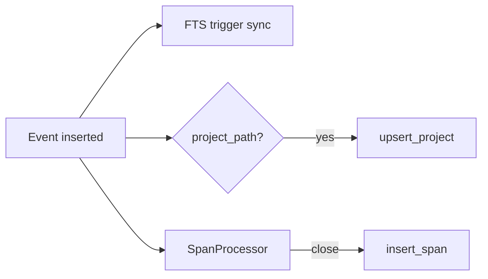

# 4. Storage and query

[← Capture pipeline](./03-capture-pipeline.md) · [Docs index](./README.md) · Next: [Clients and development →](./05-clients-and-development.md)

---

## Storage location

| Setting | Default |
|---------|---------|
| Database | `~/.chronicle/chronicle.db` |
| Journal mode | WAL (`PRAGMA journal_mode=WAL`) |
| Foreign keys | ON |

Override with `chronicle-daemon start --store /path/to/db`.

The store is opened once per daemon lifetime. Migrations run automatically on open (`crates/chronicle-store/migrations/`).

---

## Schema

### `events`

Primary fact table. One row per `CanonicalEvent`.

| Column | Type | Notes |
|--------|------|-------|
| `id` | TEXT PK | UUID string |
| `timestamp` | INTEGER | Unix ms |
| `source` | TEXT | Emitter |
| `category` | TEXT | JSON-serialized `EventCategory` |
| `type` | TEXT | Event type string |
| `project` | TEXT NULL | Repo name |
| `workspace` | TEXT NULL | Reserved |
| `duration_ms` | INTEGER NULL | Optional duration |
| `metadata` | TEXT | JSON object |
| `created_at` | INTEGER | Insert time |

**Indexes:** `timestamp DESC`, `project`, `category`

### `events_fts` (FTS5)

Virtual table indexing: `source`, `type`, `project`, `workspace`, `metadata`.

Uses **external content** (`content='events'`) — triggers in `002_fts_triggers.sql` keep FTS rows synchronized on insert/update/delete.

Search query builder (`build_fts_query`) AND-joins quoted tokens:

`cargo test` → `"cargo" AND "test"`

### `spans`

Derived session segments from `SpanProcessor`.

| Column | Notes |
|--------|-------|
| `span_type` | JSON `SpanType` |
| `started_at` / `ended_at` | Unix ms |
| `event_count` | Events in span |
| `trace_id` / `parent_id` | Reserved for future nesting |

### `sessions`

Schema ready for higher-level rollups (`session_type`, `summary`). Not yet populated by the daemon — UI uses `spans` directly.

### `projects`

| Column | Notes |
|--------|-------|
| `name` | PK — folder name |
| `path` | Absolute repo root |
| `last_active` | Updated on `upsert_project` |
| `language` | Optional hint |
| `repo_url` | Reserved |

Only paths with `.git` or `Cargo.toml` survive `prune_non_repo_projects`.

### `plugins`

Reserved for `chronicle-plugin` dynamic collectors.

---

## Write path

```rust
// chronicle-store
store.insert_event(&event)?;
store.insert_span(&span)?;      // when span closes
store.upsert_project(name, path, language)?;
```

`insert_event_batch` wraps a transaction for bulk import (tests / future tooling).

**Single writer assumption:** only `process_events` and synchronous IPC handlers (`emit_event`) write. No concurrent processes should open the DB for write.

---

## Query API

All query methods live on `chronicle_store::Store`.

### Timeline / activity

| Method | Purpose | Filters |
|--------|---------|---------|
| `query_events` | Raw events in time range | None |
| `query_activity_events` | UI timeline feed | High-signal categories/types only; excludes Chronicle UI focus |
| `query_activity_events_for_project` | Project detail page | Same as above + `project = ?` |
| `query_spans` | Recent spans | `started_at` range |
| `query_spans_for_project` | Project sessions | `project = ?` |

**Activity filter** (simplified):

- Include: `os`, `shell`, `git` categories; `file.created`, `file.deleted`
- Exclude: `file.modified`, `git.other`, Chronicle UI in metadata

### Search

```rust
store.search_events(query, limit)
```

Joins `events` ↔ `events_fts` with `ORDER BY rank`.

`SearchMode::Semantic` exists in IPC but is **not implemented** — keyword FTS only.

### Projects

```rust
store.query_projects(limit)           // ORDER BY last_active DESC
store.query_project_by_name(name)
store.count_projects()
```

### Spans

```rust
store.query_span_by_id(id)
```

Used by session detail page to load events between `started_at` and `ended_at`.

### Stats

```rust
store.count_events()
store.count_spans()
```

Returned in `GetStatus` IPC.

---

## IPC mapping

Daemon handlers in `handle_connection` map requests to store calls:

| DaemonRequest | Store / logic |
|---------------|---------------|
| `get_timeline` | `query_spans` |
| `get_events` | `query_activity_events` |
| `search` | `search_events` |
| `list_projects` | `query_projects` |
| `get_project_context` | `query_project_by_name` + `query_spans_for_project` + `query_activity_events_for_project` |
| `get_span` | `query_span_by_id` + time-bounded events |
| `get_status` | `count_events` + uptime |
| `emit_event` | `insert_event` (bypasses collectors) |

Unimplemented IPC requests return `Error { code: 400, message: "unimplemented" }`:

- `get_errors`, `get_sessions` (enums exist for future work)

---

## Data lifecycle



### Retention

No automatic pruning yet. The database grows with activity. Manual cleanup:

```bash
sqlite3 ~/.chronicle/chronicle.db "DELETE FROM events WHERE timestamp < ..."
# Then VACUUM if needed
```

Future: configurable retention policy in `config.toml`.

---

## Inspecting data directly

```bash
# Recent events
sqlite3 ~/.chronicle/chronicle.db "
  SELECT datetime(timestamp/1000,'unixepoch','localtime'),
         category, type, project, source
  FROM events ORDER BY timestamp DESC LIMIT 20;"

# Projects
sqlite3 ~/.chronicle/chronicle.db "
  SELECT name, path, datetime(last_active/1000,'unixepoch','localtime')
  FROM projects ORDER BY last_active DESC;"

# FTS test
sqlite3 ~/.chronicle/chronicle.db "
  SELECT e.type, e.project FROM events e
  JOIN events_fts ON e.rowid = events_fts.rowid
  WHERE events_fts MATCH 'cargo' LIMIT 10;"
```

---

## Migrations

| File | Purpose |
|------|---------|
| `001_initial.sql` | Core tables + FTS virtual table |
| `002_fts_triggers.sql` | INSERT/UPDATE/DELETE triggers for FTS sync |

To add migration `003_…`:

1. Create SQL file in `migrations/`
2. Append `execute_batch` in `Store::run_migrations`
3. Test with `Store::open_in_memory()` in unit tests

Never mutate `001` on deployed machines — append only.

---

## Performance notes

- WAL allows concurrent readers (IPC queries) while the daemon writes.
- `prepare_cached` used for hot queries.
- Activity queries cap with `LIMIT` from clients (typically 50–100).
- FTS rank is adequate for personal scale (millions of rows). Revisit at 10M+ events.
- Project bootstrap full scan runs once on empty DB — can take seconds on large trees; runs on blocking thread.

---

## Next steps

- **[Clients and development](./05-clients-and-development.md)** — IPC protocol details, Tauri, MCP, contributing
