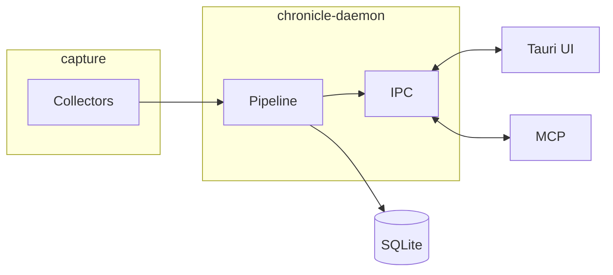

  

# Chronicle documentation

Guides for understanding, operating, and extending Chronicle.

## Reading order

| # | Document | Summary |
|---|----------|---------|
| 1 | [Introduction](./01-introduction.md) | Problem, audience, privacy principles |
| 2 | [System design](./02-system-design.md) | Processes, crates, IPC topology |
| 3 | [Capture pipeline](./03-capture-pipeline.md) | Collectors, filtering, spans, projects |
| 4 | [Storage and query](./04-storage-and-query.md) | SQLite schema, FTS, query APIs |
| 5 | [Clients and development](./05-clients-and-development.md) | UI, MCP, CLI, repo layout |
| 6 | [External plugins](./06-external-plugins.md) | IDE/browser extensions via `emit_event` |
| 7 | [macOS release signing](./07-release-macos.md) | Signed DMGs, notarization, CI secrets |

**New here?** Read **1 → 2**, then jump to **3–5** when debugging capture or building features.

## Architecture at a glance

→ Full topology in [System design](./02-system-design.md)

## Related

- [Root README](../README.md) — install, features, quick start
- [Plugins](../plugins/README.md) — manifest-based plugins
- [Extensions](../extensions/README.md) — IDE and browser emitters
